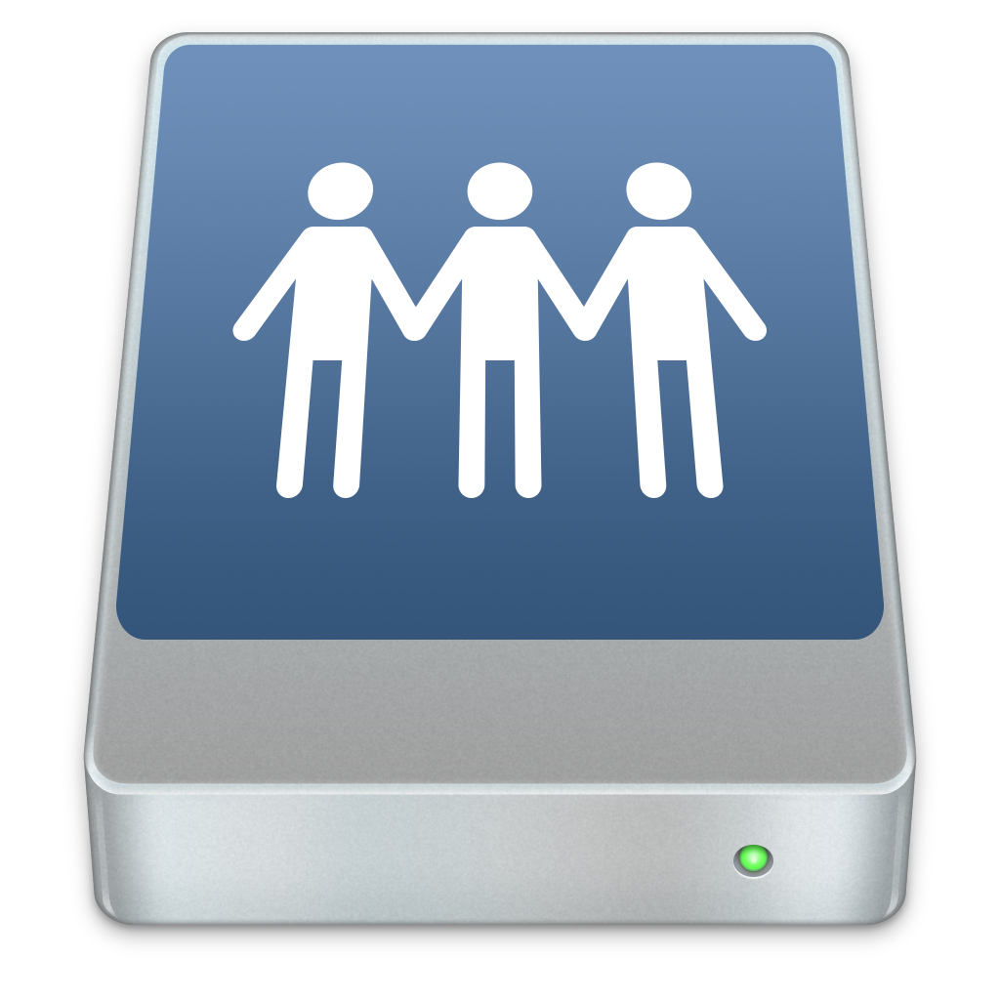

# Fichiers distants

Cliquez le bouton  dans le menu, maintenant, entrez les informations du serveur, pour changer le dossier, cliquez sur  et entrez le chemin du fichier, pour envoyer un fichier, cliquez sur 'Envoyer' et séléctionnez une application pour envoyer le fichier (Vous pouvez séléctionner fastFiles), pour télécharger un fichier, clicquez-en un. Pour faire du SSH: cliquez le bouton .
