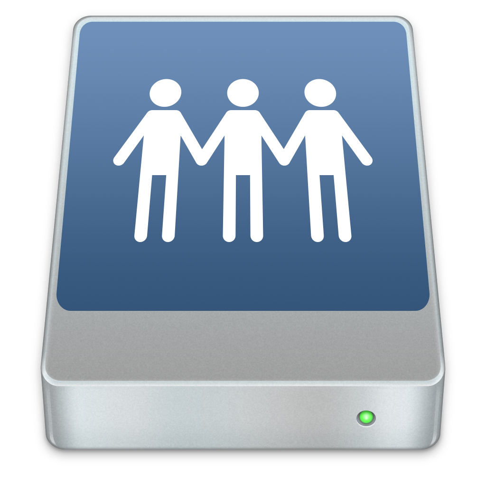

# Remote files

Press the  button in the main screen, now enter your server's crendentials, to change current directory, click the  button and enter your path, to upload a file, click the 'Upload' button and select an app to upload the file (You can select fastFiles), to download a file: just click in a file. To SSH: Click the  button.
